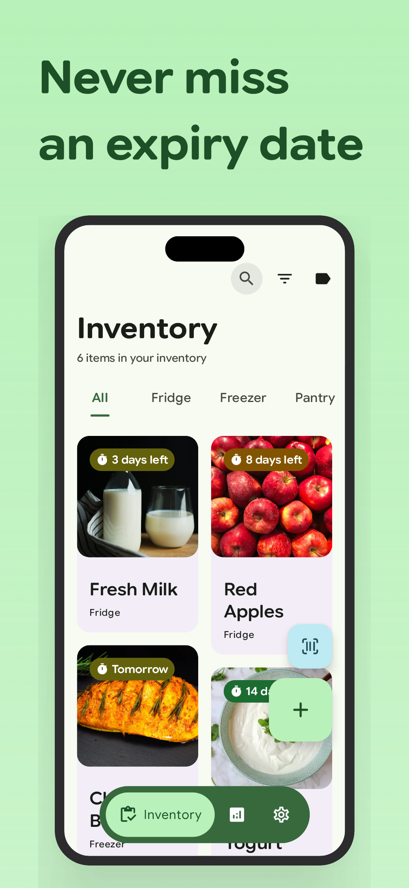
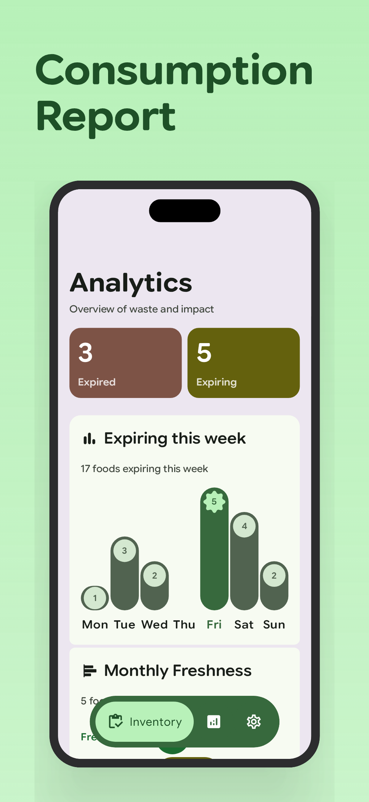
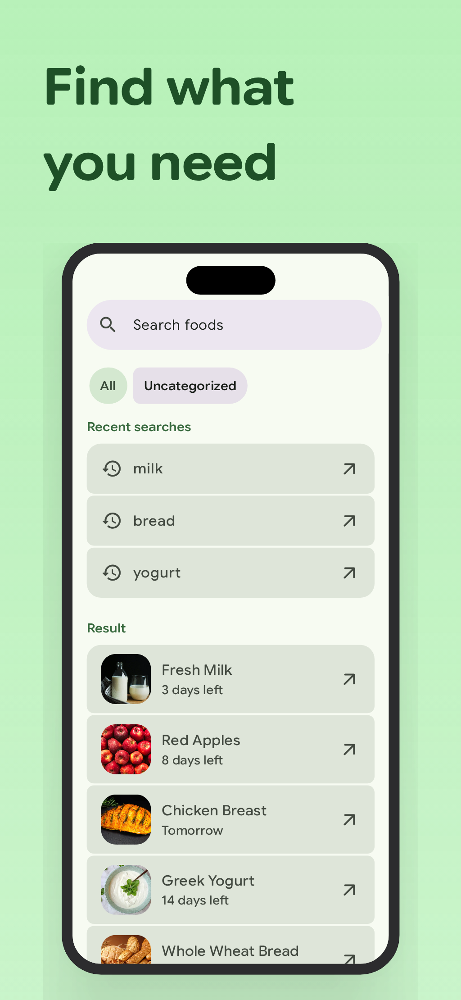
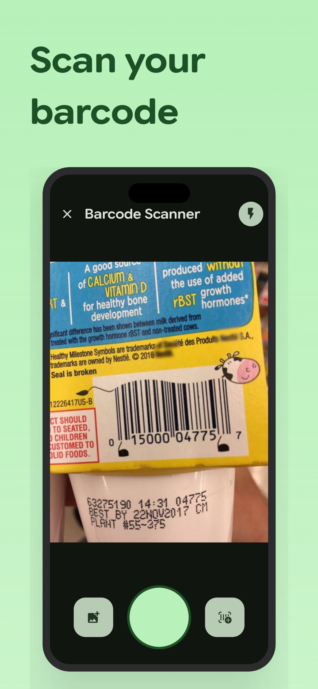

<div align="center">
  
  <h1>Algidy</h1>
  <p>
    Algidy is a Material 3 Expressive food expiry tracker app built with modern Android technologies.
    <br>
    It helps users track their groceries, reduce food waste, and maintain freshness through barcode scanning and colorful analytics.
  </p>
</div>

---

## 📷 Screenshots

<div align="center">  </div>

---

## 🚀 Features

* **Inventory Tracking:** Categorize and track food items across different storage locations (Fridge, Freezer, Pantry).
* **Intelligent Scanning:** Fast barcode scanning and food date extraction using Google ML Kit.
* **Freshness Analytics:** Visual insights into food consumption, waste patterns, and freshness status.
* **Smart Notifications:** Timely alerts for items approaching their expiry dates.
* **Secure Access:** Biometric authentication to keep your data private.

---

## 🛠 Tech Stack

* **UI:** Jetpack Compose (100%) with Material 3 Expressive.
* **Architecture:** Clean Architecture with Multi-module setup.
* **Dependency Injection:** Koin.
* **Database:** Room Database.
* **Networking:** Retrofit + OkHttp.
* **Image Loading:** Coil 3.
* **Camera / ML:** CameraX, Google ML Kit.
* **Concurrency:** Kotlin Coroutines & Flow.
* **Home Screen Widgets:** Monitor expiring foods and weekly freshness progress directly from your home screen.
---

## 🔨 Build from Source

### Requirements

* Android Studio Narwhal or newer
* JDK 17
* Android SDK 36

### Clone Repository

```bash
git clone https://github.com/NhuHuy-79/Algidy.git
cd Algidy
```

### Build Debug APK

```bash
./gradlew assembleDebug
```

### Build Release APK

```bash
./gradlew assembleRelease
```

---

## 🔒 Privacy

Algidy is designed with privacy in mind.

* No user account is required.
* Inventory data is stored locally on the device.
* No advertising.
* No analytics or user tracking.
* Camera access is only used for barcode scanning and OCR features.
* Biometric authentication is processed locally by Android and is never transmitted externally.

Users remain in full control of their data.

---

## 📱 Permissions

### Camera

Used for:

* Barcode scanning


### Notifications

Used for:

* Expiry reminders
* Food freshness alerts
* New Update available

### Biometric Authentication

Used for:

* Protecting access to the application

---

## 📦 Download

You can download the latest APK from the GitHub Releases page:

* https://github.com/NhuHuy-79/Algidy/releases

---

## 🌱 Open Source

Algidy is a free and open-source application focused on helping users reduce food waste and manage food inventory efficiently.

Contributions, bug reports, and feature suggestions are welcome.

---

## 📄 License

This project is licensed under the Apache 2.0 License.

See the [LICENSE](LICENSE) file for details.
