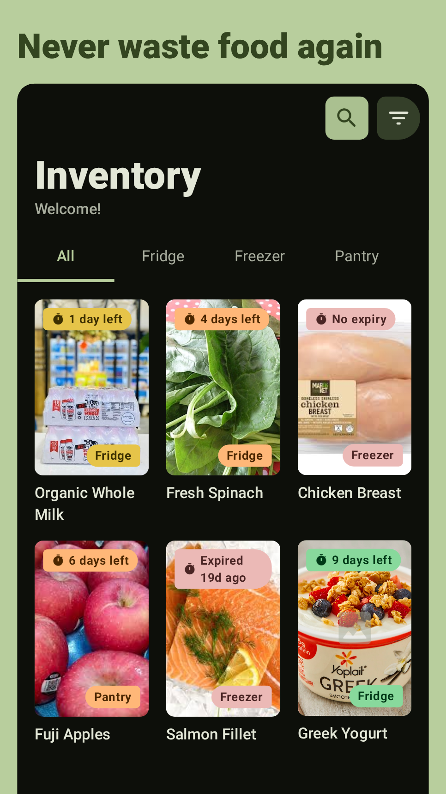
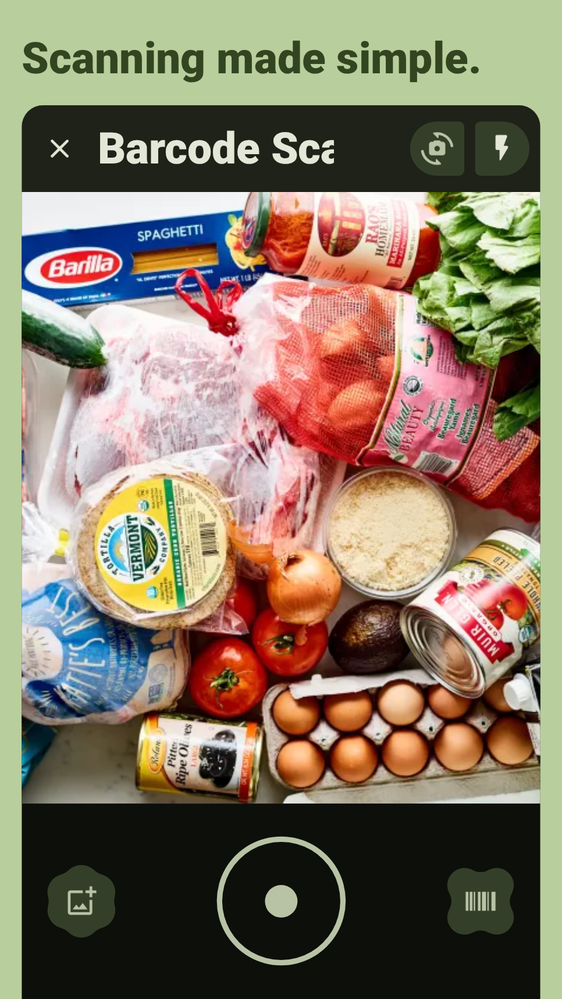
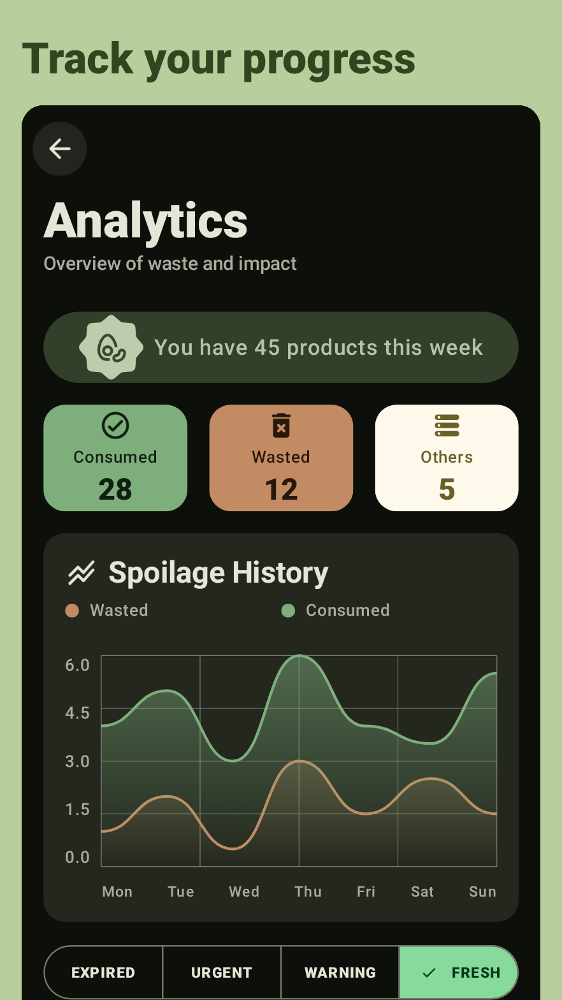
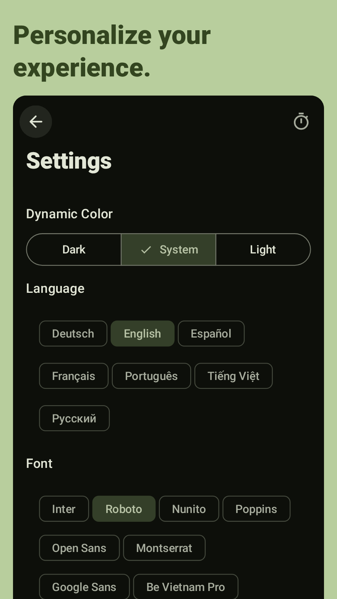

  
  <h1>Algidy</h1>
  
Algidy is a Material You food expiry tracker app built with modern Android technologies.  
     It helps users track their groceries, reduce food waste, and maintain freshness through barcode scanning and
colorful analytics.

---

## 📷 Screenshots

  <table>
    <tr>
      <td align="center"><b>Home</b></td>
      <td align="center"><b>Scanner</b></td>
    </tr>
    <tr>
      <td></td>
      <td></td>
    </tr>
    <tr>
      <td align="center"><b>Analytics</b></td>
      <td align="center"><b>Settings</b></td>
    </tr>
    <tr>
      <td></td>
      <td></td>
    </tr>
  </table>

---

## 🚀 Features

- **Inventory Tracking:** Categorize and track food items across different storage locations (
  Fridge, Freezer, Pantry).
- **Intelligent Scanning:** Fast barcode scanning and food date extraction using Google ML Kit.
- **Freshness Analytics:** Visual insights into food consumption, waste patterns, and freshness
  status.
- **Smart Notifications:** Timely alerts for items approaching their expiry dates.
- **Secure Access:** Biometric authentication to keep your data private.

---

## 🛠 Tech Stack

- **UI:** Jetpack Compose (100%) with Material 3 expressive.
- **Architecture:** Clean Architecture with Multi-module setup.
- **Dependency Injection:** Koin.
- **Database:** Room Database.
- **Networking:** Retrofit + OkHttp.
- **Image Loading:** Coil 3.
- **Camera/ML:** CameraX, Google ML Kit (Barcode, OCR, Entity Extraction).
- **Concurrency:** Kotlin Coroutines & Flow.

---

## 📦 Download

You can find the latest APK in the [Releases](https://github.com/YOUR_USERNAME/Algidy/releases)
section.

---

## 📄 License

This project is licensed under the MIT License - see the [LICENSE](LICENSE) file for details.
